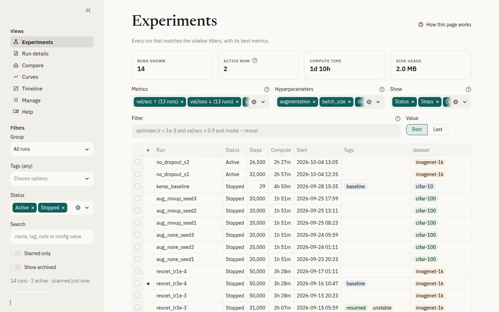

<p align="center">
  <picture>
    <source media="(prefers-color-scheme: dark)" srcset="assets/logo-dark.svg">
    
  </picture>
</p>

<h1 align="center"><code>tensorboard-book</code></h1>

<p align="center">
  <a href="pyproject.toml"></a>
  <a href="pyproject.toml"></a>
  <a href="LICENSE"></a>
  <a href="https://eagomez2.github.io/tensorboard-book/"></a>
  <a href="https://github.com/astral-sh/ruff"></a>
</p>

A web application for organizing and comparing the runs in a TensorBoard
log folder. `tensorboard-book` indexes every run, reports the best value of
each metric, and stores tags, notes and groups alongside the runs. It can
compare runs at their best step, overlay curves, show when runs were active,
browse run files, and open any selection of runs in TensorBoard.

<picture>
  <source media="(prefers-color-scheme: dark)" srcset="docs/images/experiments-dark.webp">
  
</picture>

## Install

Requires Python 3.10 or newer.

```bash
git clone https://github.com/eagomez2/tensorboard-book
cd tensorboard-book
uv tool install .      # or: pip install .
```

## Usage

Start the app on the folder that you pass to `tensorboard --logdir`:

```bash
tensorboard-book /path/to/runs
```

To try it on example data, run `tensorboard-book demo tbook-demo` and then
`tensorboard-book tbook-demo`. The
[quick start](https://eagomez2.github.io/tensorboard-book/quickstart/)
walks through the demo.

## Documentation

The documentation is available at
**[eagomez2.github.io/tensorboard-book](https://eagomez2.github.io/tensorboard-book/)**.
It covers installation, passwords and deployment, each view of the app, the
filter syntax and all commands. Its source is in [`docs/`](docs/index.md).

## License

For further details about the license of this tool, please see
[LICENSE](LICENSE), using MIT license.

## Disclaimer

`tensorboard-book` is an independent project. It is not affiliated with or
endorsed by Google or the TensorFlow team.

## Author

Esteban Gomez ([esteban.gomezmellado@aalto.fi](mailto:esteban.gomezmellado@aalto.fi))
